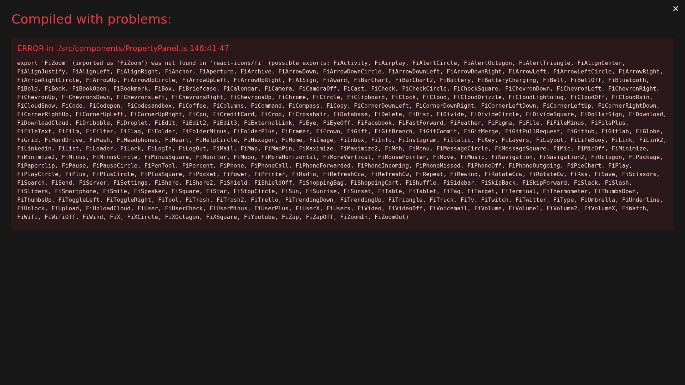
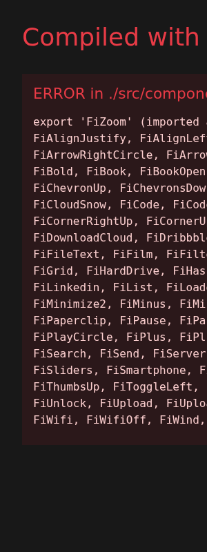
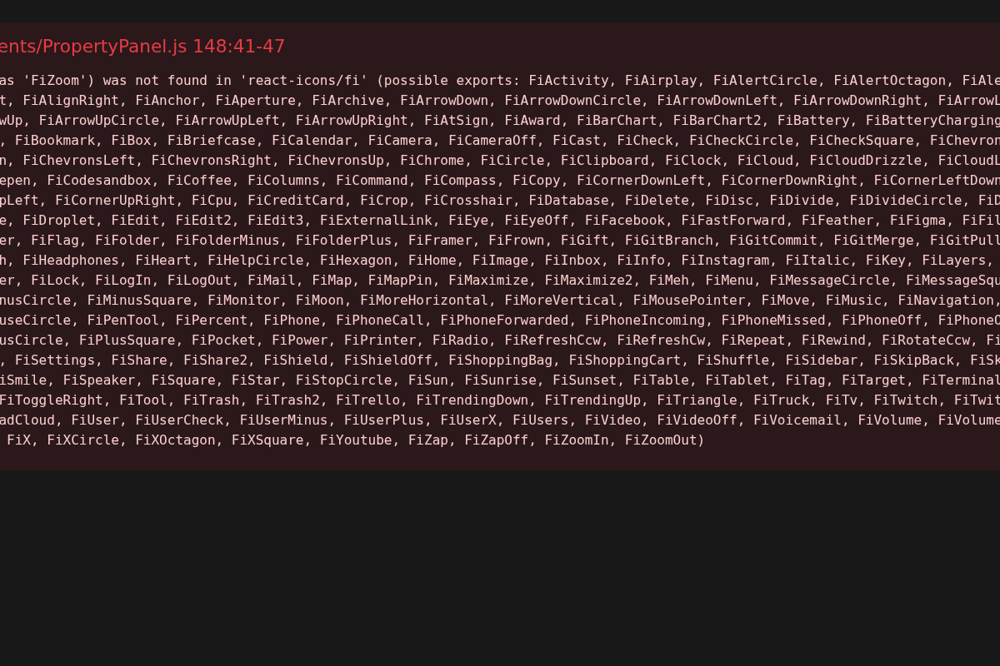
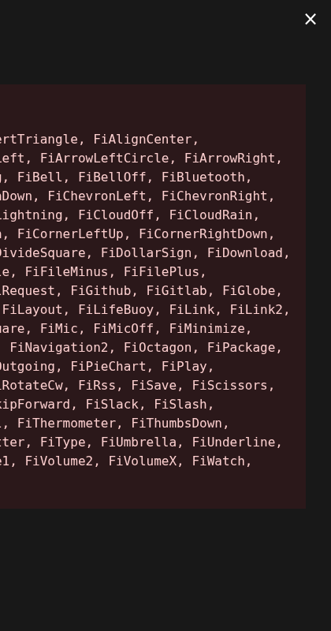

# PDF Editor Pro - Complete Documentation

A comprehensive, professional-grade PDF editing application built with React and Node.js, featuring a full suite of PDF manipulation tools and a modern, intuitive user interface.

## 📋 Table of Contents

1. [Overview](#overview)
2. [Features](#features)
3. [User Interface](#user-interface)
4. [API Documentation](#api-documentation)
5. [Installation Guide](#installation-guide)
6. [Usage Examples](#usage-examples)
7. [Technical Architecture](#technical-architecture)
8. [Troubleshooting](#troubleshooting)

## 📖 Overview

PDF Editor Pro is a full-stack web application that provides comprehensive PDF editing capabilities through a modern, user-friendly interface. The application supports everything from basic text and image insertion to advanced features like password protection, watermarking, and document compression.

### Key Highlights
- **14 Comprehensive API Endpoints** for all PDF operations
- **Professional Three-Panel Interface** with intuitive workflow
- **Real-time PDF Preview** with interactive editing
- **Drag-and-Drop File Upload** with validation
- **Modal-Based Tools** for streamlined operations
- **Security Features** including password protection and input sanitization

## 🚀 Features

### Core Editing Features
- ✅ **Text Addition** - Add custom text with font selection, sizing, and positioning
- ✅ **Image Insertion** - Upload and place images with aspect ratio control
- ✅ **Shape Drawing** - Add rectangles and shapes with customizable borders
- ✅ **Page Navigation** - Browse through multi-page documents
- ✅ **Zoom Controls** - Scale from 25% to 300% for precise editing

### Advanced Operations
- ✅ **Page Management** - Rotate pages 90° and delete specific pages
- ✅ **Document Splitting** - Split PDFs by page range
- ✅ **Document Merging** - Combine multiple PDFs into one
- ✅ **Watermarking** - Add text watermarks with opacity and rotation
- ✅ **Password Protection** - Secure documents with user passwords
- ✅ **File Compression** - Optimize PDF file sizes

### Security & Validation
- ✅ **File Type Validation** - Accept only PDF files
- ✅ **Size Limits** - 100MB maximum file size
- ✅ **Input Sanitization** - Prevent XSS and injection attacks
- ✅ **UUID File Naming** - Secure file management

## 🎨 User Interface

### Main Application Interface



The application features a professional three-panel layout:
- **Left Sidebar**: Editing tools and operations
- **Center Panel**: PDF viewer with interactive controls
- **Right Sidebar**: Document information and properties

### Toolbar and Navigation



The left toolbar provides quick access to all editing functions:
- **File Upload** - Drag-and-drop or click to upload
- **Text Tools** - Add and format text elements
- **Image Tools** - Insert and position images
- **Shape Tools** - Draw rectangles and basic shapes
- **Page Operations** - Rotate, delete, split, and merge
- **Security Tools** - Add passwords and watermarks
- **Optimization** - Compress and optimize files

### Main Content Area



The central viewing area features:
- **PDF Preview** - High-quality document rendering
- **Zoom Controls** - Scale from 25% to 300%
- **Page Navigation** - Previous/Next page buttons
- **Interactive Editing** - Click-to-place text and images
- **Real-time Updates** - Instant preview of changes

### Property Panel



The right panel displays:
- **Document Information** - File name, size, page count
- **Current Settings** - Active zoom level and page number
- **Tool Properties** - Context-sensitive options
- **History** - Recent operations (planned feature)

### Full Interface Overview


The complete interface showing all panels working together in harmony.

## 🔧 API Documentation

### Base URL
```
http://localhost:5000/api
```

### Authentication
No authentication required for local development.

### Endpoints

#### 1. File Upload
```http
POST /api/upload
Content-Type: multipart/form-data

Body: PDF file in 'pdf' field
```
**Response:**
```json
{
  "success": true,
  "fileId": "uuid-string",
  "message": "File uploaded successfully"
}
```

#### 2. Get PDF Information
```http
GET /api/pdf/:fileId/info
```
**Response:**
```json
{
  "success": true,
  "info": {
    "pageCount": 5,
    "title": "Document Title",
    "author": "Author Name",
    "subject": "Document Subject"
  }
}
```

#### 3. Add Text
```http
POST /api/pdf/:fileId/add-text
Content-Type: application/json

{
  "text": "Sample text",
  "x": 100,
  "y": 200,
  "fontSize": 14,
  "fontFamily": "Helvetica",
  "color": "#000000",
  "page": 1
}
```

#### 4. Add Image
```http
POST /api/pdf/:fileId/add-image
Content-Type: multipart/form-data

Body: 
- image: Image file
- x: X coordinate
- y: Y coordinate
- width: Image width
- height: Image height
- page: Page number
```

#### 5. Add Shape
```http
POST /api/pdf/:fileId/add-shape
Content-Type: application/json

{
  "type": "rectangle",
  "x": 50,
  "y": 100,
  "width": 200,
  "height": 100,
  "borderColor": "#000000",
  "fillColor": "#ffffff",
  "page": 1
}
```

#### 6. Rotate Page
```http
POST /api/pdf/:fileId/rotate
Content-Type: application/json

{
  "page": 1,
  "degrees": 90
}
```

#### 7. Delete Pages
```http
POST /api/pdf/:fileId/delete-pages
Content-Type: application/json

{
  "pages": [2, 4, 6]
}
```

#### 8. Split PDF
```http
POST /api/pdf/:fileId/split
Content-Type: application/json

{
  "startPage": 1,
  "endPage": 3
}
```

#### 9. Merge PDFs
```http
POST /api/pdf/merge
Content-Type: multipart/form-data

Body: Multiple PDF files
```

#### 10. Add Watermark
```http
POST /api/pdf/:fileId/watermark
Content-Type: application/json

{
  "text": "CONFIDENTIAL",
  "opacity": 0.3,
  "rotation": 45,
  "fontSize": 36,
  "color": "#ff0000"
}
```

#### 11. Add Password Protection
```http
POST /api/pdf/:fileId/password
Content-Type: application/json

{
  "password": "securepassword123"
}
```

#### 12. Compress PDF
```http
POST /api/pdf/:fileId/compress
```

#### 13. Download PDF
```http
GET /api/pdf/:fileId/download
```

#### 14. Preview PDF
```http
GET /api/pdf/:fileId/preview
```

## 🛠 Installation Guide

### Prerequisites
- Node.js 16.x or higher
- npm 8.x or higher
- 4GB RAM minimum
- 1GB free disk space

### Step-by-Step Installation

1. **Clone the Repository**
   ```bash
   git clone https://github.com/Omsinghh01/PDF-editor-.git
   cd PDF-editor-
   ```

2. **Install Dependencies**
   ```bash
   # Install root dependencies
   npm install
   
   # Install server dependencies
   cd server
   npm install
   
   # Install client dependencies
   cd ../client
   npm install
   cd ..
   ```

3. **Start the Application**
   ```bash
   # Start both server and client
   npm run dev
   ```
   
   OR start individually:
   ```bash
   # Terminal 1 - Start server
   cd server
   npm run dev
   
   # Terminal 2 - Start client
   cd client
   npm start
   ```

4. **Access the Application**
   - Frontend: http://localhost:3000
   - Backend API: http://localhost:5000

### Environment Configuration

Create a `.env` file in the server directory:
```env
PORT=5000
UPLOAD_DIR=./uploads
MAX_FILE_SIZE=104857600
CORS_ORIGIN=http://localhost:3000
```

## 📚 Usage Examples

### Example 1: Basic Text Addition

1. **Upload a PDF**
   - Drag and drop a PDF file into the upload area
   - Wait for the upload confirmation

2. **Add Text**
   - Click the "Add Text" button in the toolbar
   - Enter your text in the modal dialog
   - Select font, size, and color
   - Click on the PDF where you want to place the text
   - Click "Apply" to add the text

3. **Download Result**
   - Click "Download" to save the edited PDF

### Example 2: Image Insertion

1. **Prepare Your Image**
   - Ensure image is in JPG or PNG format
   - Recommended size: under 10MB

2. **Insert Image**
   - Click "Add Image" in the toolbar
   - Upload your image file
   - Set position coordinates (x, y)
   - Adjust width and height
   - Select target page
   - Click "Apply"

### Example 3: Document Merging

1. **Upload Multiple PDFs**
   - Use the merge tool in the toolbar
   - Select multiple PDF files
   - Choose merge order

2. **Process Merge**
   - Click "Merge Documents"
   - Wait for processing
   - Download the combined PDF

### Example 4: Adding Security

1. **Password Protection**
   - Click "Add Password" in security tools
   - Enter a strong password
   - Confirm the password
   - Apply protection

2. **Add Watermark**
   - Click "Add Watermark"
   - Enter watermark text
   - Adjust opacity and rotation
   - Apply to document

## 🏗 Technical Architecture

### Frontend Architecture (React)

```
client/
├── public/
│   └── index.html          # Main HTML template
├── src/
│   ├── components/
│   │   ├── App.js          # Main application component
│   │   ├── FileUpload.js   # Drag-and-drop upload
│   │   ├── PDFViewer.js    # PDF display component
│   │   ├── Toolbar.js      # Left sidebar tools
│   │   ├── PropertyPanel.js # Right sidebar info
│   │   └── modals/         # Modal dialogs
│   │       ├── TextModal.js
│   │       ├── ImageModal.js
│   │       ├── ShapeModal.js
│   │       ├── WatermarkModal.js
│   │       ├── PasswordModal.js
│   │       ├── SplitModal.js
│   │       └── MergeModal.js
│   ├── services/
│   │   └── api.js          # API communication layer
│   ├── App.css             # Main styles
│   └── index.js            # React entry point
└── package.json            # Frontend dependencies
```

### Backend Architecture (Node.js/Express)

```
server/
├── index.js                # Express server setup
├── uploads/                # File storage directory
├── package.json            # Backend dependencies
└── .env                    # Environment configuration
```

### Key Dependencies

**Frontend:**
- React 18.2.0 - UI framework
- react-pdf 7.5.1 - PDF rendering
- styled-components 6.1.1 - CSS-in-JS styling
- axios 1.6.2 - HTTP client
- react-dropzone 14.2.3 - File upload handling
- react-icons 4.12.0 - Icon library
- react-toastify 9.1.3 - Notifications

**Backend:**
- express 4.18.2 - Web framework
- cors 2.8.5 - Cross-origin resource sharing
- multer 1.4.5-lts.1 - File upload middleware
- pdf-lib 1.17.1 - PDF manipulation
- sharp 0.33.0 - Image processing
- uuid 9.0.1 - Unique ID generation
- archiver 6.0.1 - ZIP file creation

### Data Flow

1. **File Upload Flow**
   ```
   User selects file → FileUpload component → API call → 
   Multer middleware → File validation → Storage → 
   Response with fileId
   ```

2. **PDF Processing Flow**
   ```
   User action → Modal input → API call → 
   pdf-lib processing → File update → 
   Response confirmation → UI update
   ```

3. **Download Flow**
   ```
   Download request → Server retrieval → 
   File stream → Browser download
   ```

## 🐛 Troubleshooting

### Common Issues

#### Issue 1: Upload Fails
**Symptoms:** File upload returns error or hangs
**Solutions:**
- Check file size (max 100MB)
- Ensure file is valid PDF format
- Verify server is running on port 5000
- Check network connectivity

#### Issue 2: PDF Preview Not Loading
**Symptoms:** PDF viewer shows blank or error
**Solutions:**
- Refresh the page
- Check console for JavaScript errors
- Ensure PDF is not corrupted
- Try a different PDF file

#### Issue 3: Text/Image Addition Fails
**Symptoms:** Modal opens but changes don't apply
**Solutions:**
- Check coordinates are within page bounds
- Ensure valid font size (1-100)
- Verify image format (JPG/PNG only)
- Check server logs for errors

#### Issue 4: Download Problems
**Symptoms:** Download doesn't start or file is corrupted
**Solutions:**
- Wait for processing to complete
- Check available disk space
- Try downloading again
- Clear browser cache

### Performance Tips

1. **Optimize File Sizes**
   - Use PDF compression before upload
   - Optimize images before insertion
   - Limit document size for better performance

2. **Browser Performance**
   - Use modern browsers (Chrome, Firefox, Safari)
   - Close unnecessary tabs
   - Clear browser cache regularly

3. **Server Performance**
   - Ensure adequate RAM (4GB+)
   - Monitor disk space
   - Restart server if memory issues occur

### Error Codes

| Code | Description | Solution |
|------|-------------|----------|
| 400 | Bad Request | Check input parameters |
| 404 | File Not Found | Verify fileId is correct |
| 413 | File Too Large | Reduce file size |
| 500 | Server Error | Check server logs |

### Getting Help

1. **Check Console Logs**
   - Open browser developer tools (F12)
   - Look for error messages in console

2. **Server Logs**
   - Check terminal where server is running
   - Look for error messages and stack traces

3. **GitHub Issues**
   - Report bugs at: https://github.com/Omsinghh01/PDF-editor-/issues
   - Include error messages and steps to reproduce

---

## 📄 License

This project is licensed under the MIT License - see the [LICENSE](LICENSE) file for details.

## 🤝 Contributing

Contributions are welcome! Please feel free to submit a Pull Request.

## 📞 Support

For support and questions:
- Create an issue on GitHub
- Email: support@example.com
- Documentation: This file

---

**PDF Editor Pro** - Professional PDF editing made simple and accessible.